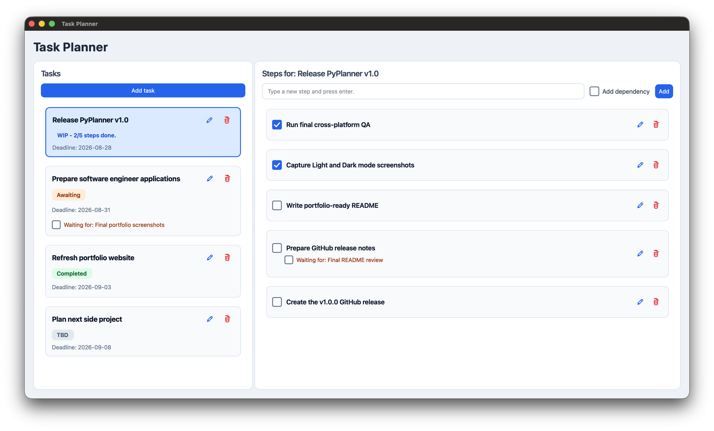
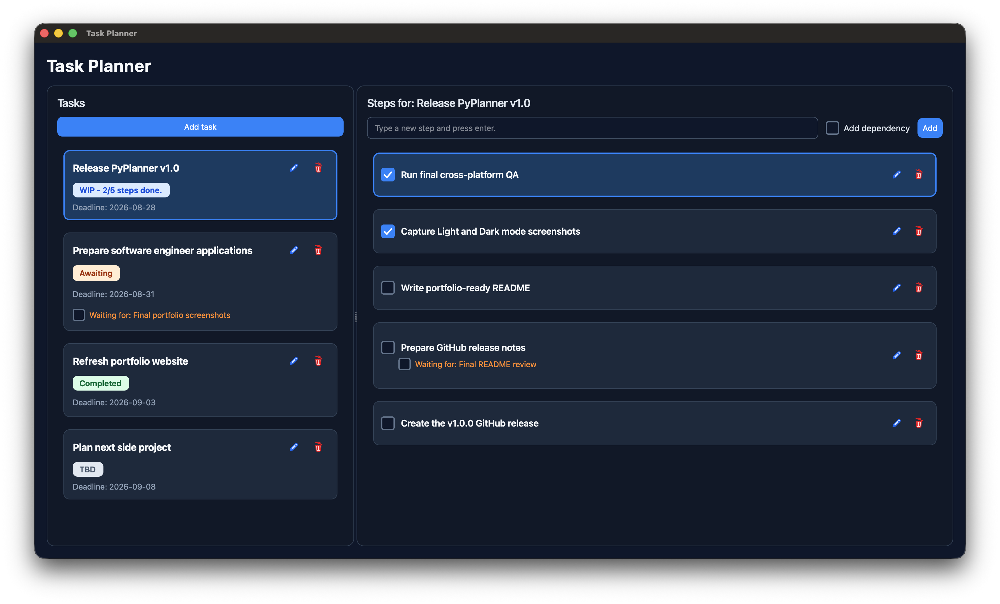

# PyPlanner

A desktop task-planning application built with **Python, PySide6 and SQLite**.

PyPlanner is designed around tasks, steps and dependencies. Tasks can be broken into smaller steps, reordered manually, tracked through automatically calculated statuses, and marked as blocked by external dependencies.

## Screenshots

| Light mode | Dark mode |
| --- | --- |
|  |  |

## Features

- Create, edit and delete tasks
- Break tasks into individual steps
- Mark steps as complete
- Add dependencies to tasks and steps
- Mark dependencies as resolved
- Automatically calculate task status
- Reorder tasks with drag and drop
- Reorder steps with drag and drop
- Persist task and step ordering
- Store planner data locally with SQLite
- Switch between Light and Dark themes at runtime
- Persist theme preference between sessions
- Responsive custom task and step cards
- Visual hover and selected states
- Confirmation dialogs for destructive actions

## Task Statuses

PyPlanner calculates each task's status automatically based on its steps and unresolved dependencies.

| Status | Meaning |
| --- | --- |
| **TBD** | The task has no completed steps yet, or has no steps |
| **WIP** | Some steps are complete, but work remains |
| **Awaiting** | All steps are complete, but a task or step dependency is still unresolved |
| **Completed** | All steps are complete and all dependencies are resolved |

For tasks in progress, PyPlanner also displays completion progress such as:

```text
WIP - 2/5 steps done.
```

## Dependencies

Both tasks and individual steps can depend on an external person, event or piece of work.

Dependencies are displayed directly on their card and can be marked as resolved independently from step completion. This allows PyPlanner to distinguish between work that is finished and work that is finished but still waiting on something external.

## Technology

- **Python 3**
- **PySide6 / Qt** for the desktop interface
- **SQLite** for local data persistence
- **QSettings** for persistent application preferences
- **Git / GitHub** for version control

## Project Structure

```text
PyPlanner/
├── assets/
│   └── icons/
│       ├── check.svg
│       ├── delete.svg
│       └── edit.svg
├── config/
│   ├── __init__.py
│   └── app_settings.py
├── dialogs/
│   ├── __init__.py
│   ├── add_task_dialog.py
│   ├── dependency_dialog.py
│   ├── edit_step_dialog.py
│   ├── edit_task_dialog.py
│   └── settings_dialog.py
├── docs/
│   ├── pyplanner-dark.png
│   └── pyplanner-light.png
├── menus/
│   ├── __init__.py
│   └── app_menu_bar.py
├── themes/
│   ├── __init__.py
│   ├── dark.py
│   ├── light.py
│   └── theme_manager.py
├── widgets/
│   ├── __init__.py
│   ├── reorderable_list_widget.py
│   ├── step_card.py
│   └── task_card.py
├── database.py
├── main.py
├── requirements.txt
└── README.md
```

The application is separated into dedicated modules rather than keeping all UI and application logic in a single file.

- `database.py` owns SQLite persistence and task-status calculation.
- `dialogs/` contains reusable task, step, dependency and settings dialogs.
- `widgets/` contains reusable custom task cards, step cards and drag-and-drop list behaviour.
- `themes/` contains Light and Dark stylesheets plus the theme manager.
- `config/` contains persistent application settings.
- `menus/` contains the application menu bar.

## Installation

### 1. Clone the repository

```bash
git clone <repository-url>
cd <repository-directory>
```

Replace `<repository-url>` and `<repository-directory>` with the GitHub repository details.

### 2. Create a virtual environment

```bash
python3 -m venv .venv
```

### 3. Activate the virtual environment

macOS / Linux:

```bash
source .venv/bin/activate
```

Windows PowerShell:

```powershell
.venv\Scripts\Activate.ps1
```

### 4. Install dependencies

```bash
python -m pip install -r requirements.txt
```

### 5. Run PyPlanner

```bash
python main.py
```

On systems where Python is exposed as `python3`, use:

```bash
python3 main.py
```

## Data Persistence

PyPlanner stores task and step data locally in:

```text
planner.db
```

The database is created automatically when the application first runs.

Local database files are ignored by Git, so personal planner data is never included in the repository.

## Themes

PyPlanner includes both **Light** and **Dark** themes.

Themes can be changed at runtime through:

```text
Settings → Preferences
```

The selected theme is saved using `QSettings` and restored automatically the next time the application launches.

## Design Notes

A few areas of the project were intentionally implemented as reusable components:

- Task and step cards are custom widgets rather than plain list rows.
- Task and step ordering is persisted to SQLite after drag-and-drop operations.
- The drag-and-drop list uses a custom insertion indicator and translucent drag preview.
- Theme styling is kept outside the main application file and applied through a dedicated theme manager.
- Selection state is applied directly to task and step cards, allowing consistent visual feedback across themes.
- Task status is derived from persisted task, step and dependency state rather than manually selected by the user.

## Project Status

**v1.0**

The first release focuses on the core desktop planning workflow: task management, step tracking, dependencies, automatic statuses, persistent ordering and theme support.

## Potential Future Improvements

- Task search and filtering
- Additional sorting options
- Due-date reminders and notifications
- More application preferences
- Packaged desktop builds
- Automated tests
- Additional accessibility and keyboard-navigation improvements
